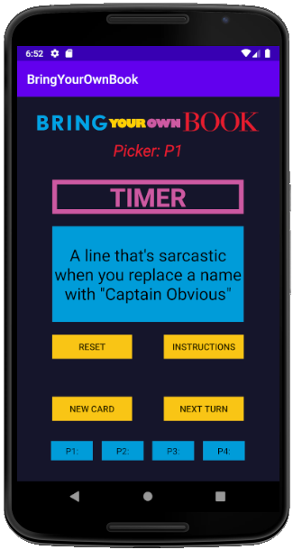
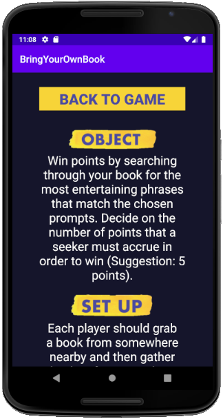
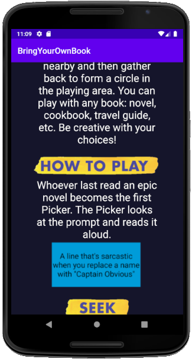
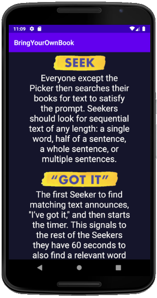
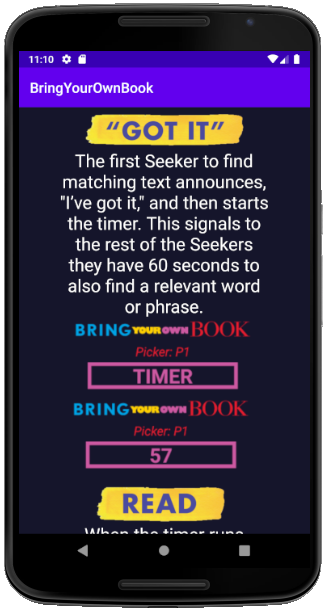
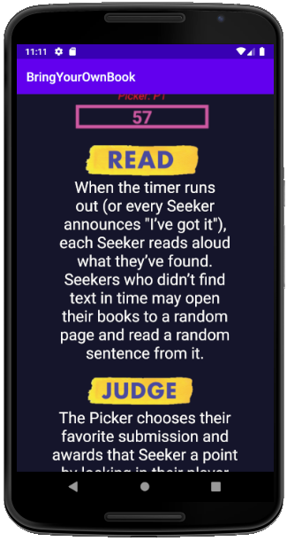
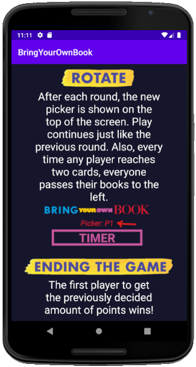

# Bring Your Own Book

#### Bring Your Own Book is an in-person multiplayer party game with unlimited playability!
#### It is an old board game that has been transformed into an android app so the fun is always in your pocket.
#### This app was created using Java and XML in Android Studios.
#### The prompts are stored as Card objects. Also a Stack Abstract Data Type is implemented to simulate a Deck for gameplay.
#### [Link to Java code](https://github.com/GursherBaath/BringYourOwnBookApp/tree/master/app/src/main/java/com/example/bringyourownbook)
#### [Link to XML code](https://github.com/GursherBaath/BringYourOwnBookApp/tree/master/app/src/main/res/layout)
## Instructions GUI

